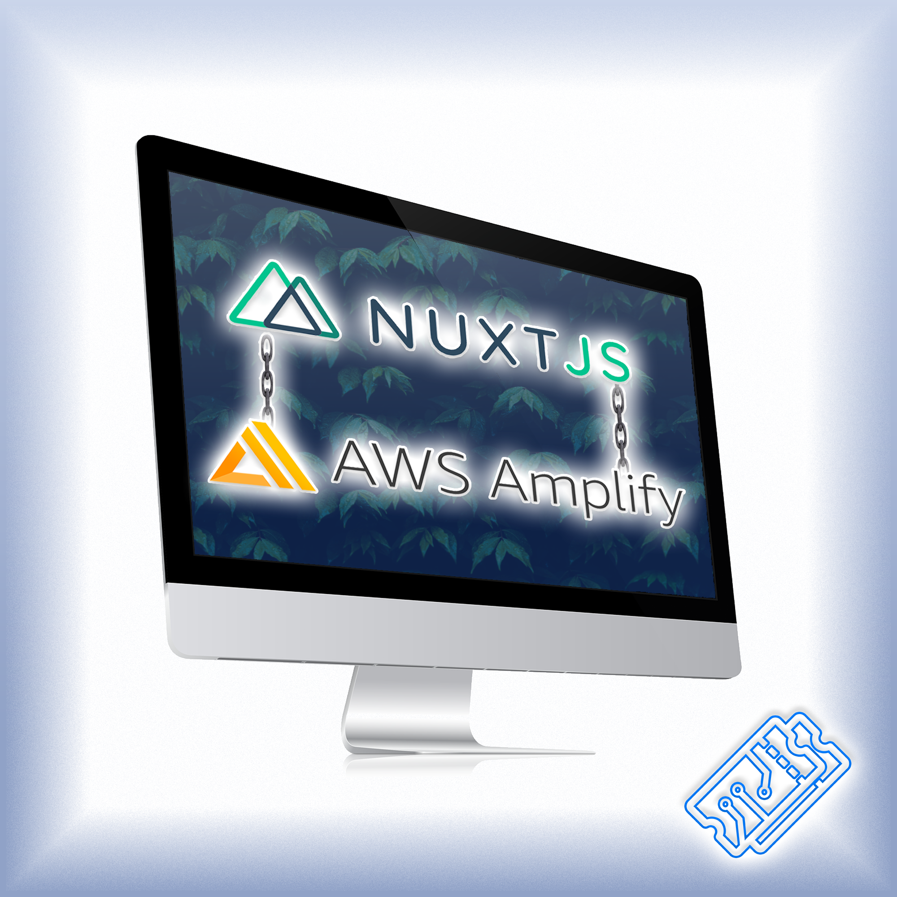

# [T3chFlicks](https://t3chflicks.org): Three Smart Home Basics
> A few short tutorials to help novices get started with smart home appliances and connecting to a voice controlled system.

--- 

## `tutorials`

---

This project was created by [T3chFlicks](https://t3chflicks.org) - A tech focused education and services company.

---